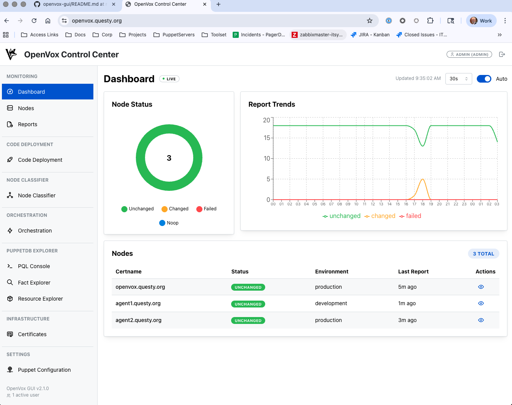
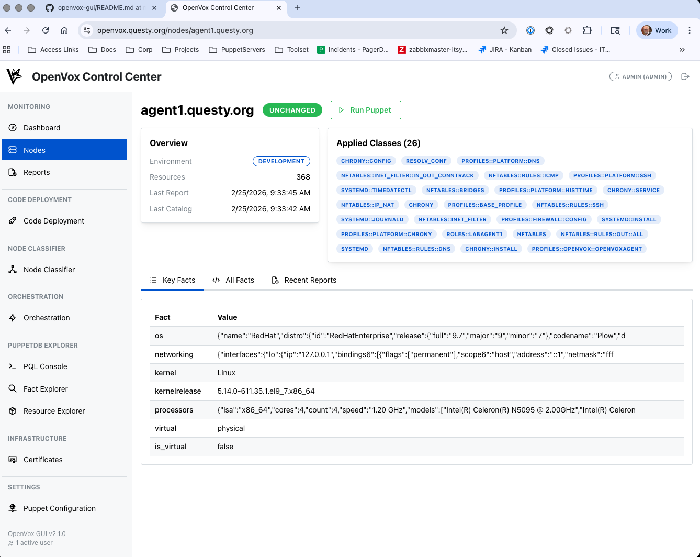
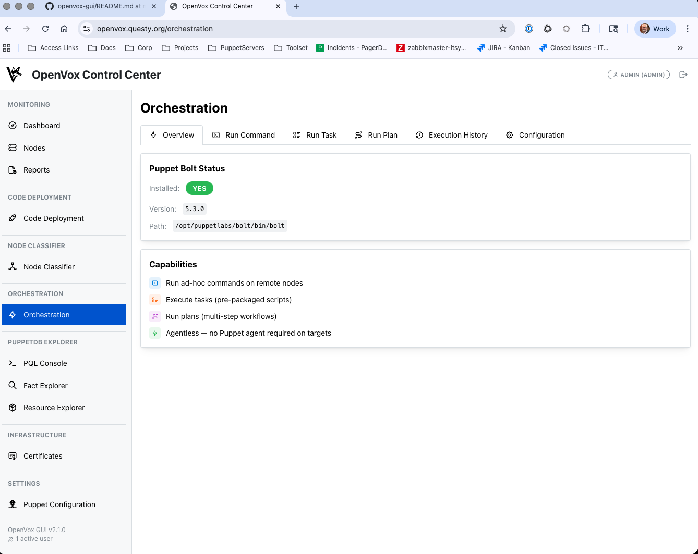

# OpenVox GUI

**Version 1.4.8** | [Installation Guide](INSTALL.md) | [Update Guide](UPDATE.md) | [Troubleshooting](TROUBLESHOOTING.md)

A user-friendly web interface for managing your Puppet infrastructure. Think of it as a control center for all your servers - you can see what's happening, fix problems, and make changes from one place.


## 🎯 What is OpenVox GUI?

OpenVox GUI is like a dashboard for your car, but for your servers. If you use Puppet to manage your servers (and if you don't know what Puppet is, think of it as software that keeps all your servers configured correctly), then OpenVox GUI gives you a visual way to:

- **See what's happening** - Which servers are healthy, which ones have problems
- **Find and fix issues** - Click through to see exactly what went wrong
- **Make changes** - Update configurations without typing commands
- **Run commands** - Execute tasks on multiple servers at once

## 📸 Screenshots

| Dashboard | Node Details | Orchestration |
|-----------|--------------|---------------|
|  |  |  |

## 🚀 Quick Start

If you just want to get up and running quickly:

```bash
# Clone the repository
git clone https://github.com/cvquesty/openvox-gui.git
cd openvox-gui

# Run the installer (it will ask you questions)
sudo ./install.sh

# Open your web browser and go to:
# https://your-server-name:4567
```

That's it! For detailed installation instructions, see the [Installation Guide](INSTALL.md).

## 📚 Documentation

- **[Installation Guide](INSTALL.md)** - Step-by-step guide for new installations
- **[Update Guide](UPDATE.md)** - How to update to newer versions
- **[Troubleshooting](TROUBLESHOOTING.md)** - Solutions to common problems
- **[Configuration](docs/CONFIGURATION.md)** - Detailed configuration options
- **[API Reference](docs/API.md)** - For developers who want to integrate

## ✨ Main Features

### 📊 Dashboard
See everything at a glance:
- How many servers are running fine vs having problems
- Recent activity and changes
- System health indicators
- Who's currently using the system

### 📋 Detailed Reports
Click on any server to see:
- What changed in the last update
- Any errors or warnings
- Performance metrics (how long things took)
- Complete logs of what happened

### 🚀 Code Deployment
Deploy new configurations to your servers:
- One button to update everything
- Choose specific environments to update
- See the results in real-time
- Keep a history of all deployments

### ⚡ Orchestration (Running Commands)
Run commands on multiple servers at once:
- Execute shell commands across your fleet
- Run pre-built tasks and plans
- See the output from each server
- Save commonly used commands

### 🏷️ Node Classifier
Control what software and settings each server gets:
- Set defaults for all servers
- Create groups of servers with similar needs
- Override settings for individual servers
- Preview changes before applying them

### 📁 Data Management
Edit your configuration files directly:
- Browse and edit Hiera data files (server settings)
- Edit configuration files with syntax checking
- Automatic backups before changes
- Create and delete files as needed

### 🔐 Certificate Management
Manage server certificates (like ID cards for servers):
- View all certificates and their status
- Sign new certificates to allow servers to connect
- Revoke certificates for decommissioned servers
- See certificate details and expiration dates

### 🔍 Explorers
Search and explore your infrastructure:
- **Fact Explorer**: Find servers by their properties (OS, memory, etc.)
- **Resource Explorer**: Search for installed software, services, files
- **PQL Console**: Run advanced queries (for power users)

### 🎨 Themes
Choose how the interface looks:
- **Casual Mode**: Fun, colorful interface with animations
- **Formal Mode**: Clean, professional business interface

## 🛠️ System Requirements

### Minimum Requirements

You need a Linux server with:
- **Operating System**: Red Hat 8+, CentOS 8+, Ubuntu 20.04+, or similar
- **Memory**: At least 2GB RAM (4GB recommended)
- **Disk Space**: 1GB free space
- **Python**: Version 3.10 or newer (3.11+ recommended)
- **Network**: Access to your PuppetServer and PuppetDB

### What Gets Installed

The installer will set up:
- A web server running on port 4567 (configurable)
- A systemd service that starts automatically
- All necessary Python packages in a virtual environment
- A local database for storing settings
- Log files in `/opt/openvox-gui/logs`

## 🚪 Default Access

After installation:
- **URL**: `https://your-server:4567`
- **Username**: `admin`
- **Password**: Check the file `/opt/openvox-gui/config/.credentials`

**Important**: Change the default password immediately after your first login!

## 🔧 Basic Administration

### Starting and Stopping

```bash
# Check if it's running
sudo systemctl status openvox-gui

# Stop the service
sudo systemctl stop openvox-gui

# Start the service
sudo systemctl start openvox-gui

# Restart (after making changes)
sudo systemctl restart openvox-gui
```

### Viewing Logs

```bash
# See recent log entries
sudo journalctl -u openvox-gui -n 50

# Watch logs in real-time (press Ctrl+C to stop)
sudo journalctl -u openvox-gui -f
```

### Managing Users

```bash
# Add a new user
cd /opt/openvox-gui
sudo ./scripts/manage_user.py add newuser --role operator

# Change a password
sudo ./scripts/manage_user.py passwd username

# Delete a user
sudo ./scripts/manage_user.py delete username

# List all users
sudo ./scripts/manage_user.py list
```

## 🌟 What's New in Version 1.4.8

### Run Puppet Fix
- **"Run Puppet" button now works** — was always failing with exit code 1 because the `puppet_agent` Bolt module wasn't installed. Now uses `bolt command run` with `puppet agent -t` directly.
- Puppet exit code 2 (changes applied) is now correctly shown as success

### Security — All Dependabot Alerts Resolved (1.4.7)
- **python-multipart** 0.0.20→0.0.22 (CVE-2026-24486, HIGH): Fixed arbitrary file write vulnerability
- **esbuild** (GHSA-67mh-4wv8-2f99, MODERATE): Fully resolved via Vite 6.4.1 (bundles esbuild ≥ 0.25.0)
- **Python runtime**: Upgraded production from 3.9 to 3.11

### Ghost User Prevention (1.4.5)
- **Username whitespace stripping**: Usernames are now automatically trimmed on creation and login, preventing "ghost" users that can't be deleted (e.g. `"adrian "` vs `"adrian"`)

### Centralized Version Management (1.4.4)
- **Single source of truth**: The version is now defined in exactly two canonical files (`backend/app/__init__.py` and `frontend/package.json`) — all other code reads from these at build/import time
- **No more version drift**: A new `scripts/bump-version.sh` script updates both files atomically so they can never get out of sync
- **Login page version fix**: The login page was stuck showing v1.3.0 while the dashboard showed v1.4.3 — now both read from the same source

### Previous Release Highlights (1.4.3)

### Bug Fixes
- **User Deletion Fix**: Fixed a bug where deleting a user from the User Manager would return a false "404: User not found" error even though the deletion succeeded

### Security Enhancements
- **Comprehensive Security Update**: Fixed all critical vulnerabilities identified by GitHub Dependabot
- **Security Headers**: Added CSP, HSTS, X-Frame-Options, and other security headers
- **Rate Limiting**: Added brute force protection on authentication endpoints
- **Input Validation**: New sanitization module for all user inputs
- **Updated Dependencies**: All Python and JavaScript packages updated to latest secure versions

### Major Improvements
- **Better Update Experience**: The app now handles updates gracefully - no more errors when we deploy new versions while you're using it
- **Improved Scrolling**: Fixed scrolling issues throughout the interface, including Node Details "All Facts" tab
- **Enhanced Fact Explorer**: Now supports nested facts with autocomplete
- **Certificate Authority Panel**: Comprehensive view of your CA status and certificates
- **Better Error Messages**: Clearer, more helpful error messages when things go wrong

### Recent Fixes
- Fixed user deletion returning false 404 errors
- Fixed navigation errors after deployments
- Fixed result window scrolling in Orchestration
- Fixed certificate statistics accuracy
- Fixed fact value display for large data
- Improved module loading with better caching
- Fixed Node Details "All Facts" tab scrollability

For a complete list of changes, see the [Changelog](CHANGELOG.md).

## 📞 Getting Help

### If Something Goes Wrong

1. **Check the Troubleshooting Guide**: [TROUBLESHOOTING.md](TROUBLESHOOTING.md) has solutions to common problems
2. **Look at the Logs**: Run `sudo journalctl -u openvox-gui -n 100` to see recent errors
3. **Check Your Network**: Make sure you can reach PuppetServer and PuppetDB from this server
4. **File an Issue**: Visit [GitHub Issues](https://github.com/cvquesty/openvox-gui/issues) to report bugs

### Community

- **GitHub**: [https://github.com/cvquesty/openvox-gui](https://github.com/cvquesty/openvox-gui)
- **Discussions**: Use GitHub Discussions for questions and ideas
- **Contributing**: Pull requests welcome! See [CONTRIBUTING.md](CONTRIBUTING.md)

## 📄 License

This project is licensed under the Apache 2.0 License. This means you can:
- Use it for free (even commercially)
- Modify it to suit your needs  
- Distribute it to others
- Just keep the license notice intact

See the [LICENSE](LICENSE) file for the legal details.

## 🙏 Acknowledgments

Built with love for the Puppet community. Special thanks to:
- The Vox Pupuli community for maintaining Puppet modules
- All contributors who have submitted bugs, suggestions, and code
- You, for using OpenVox GUI!

---

**Ready to get started?** Head over to the [Installation Guide](INSTALL.md) for step-by-step instructions!
