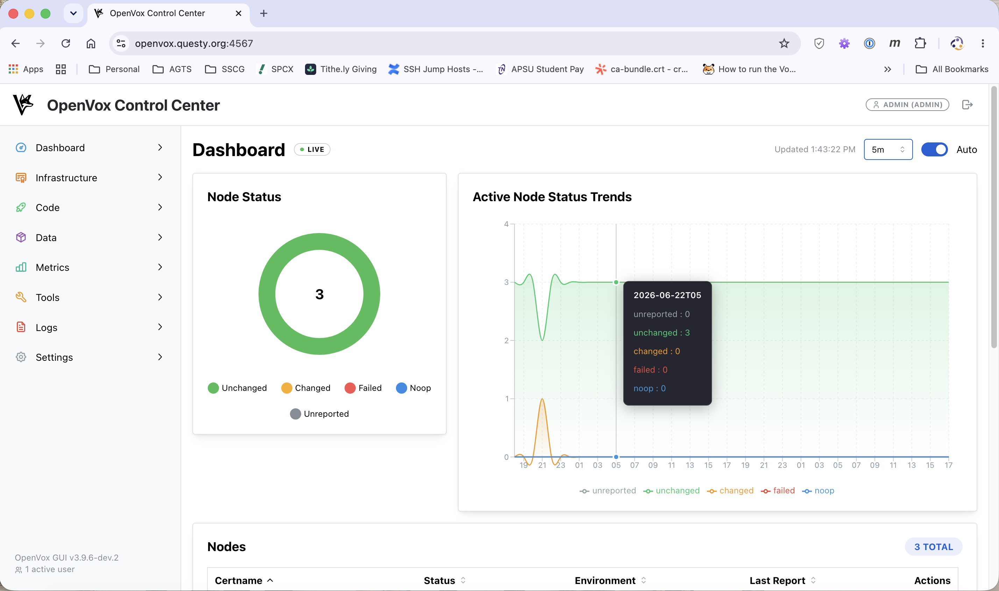
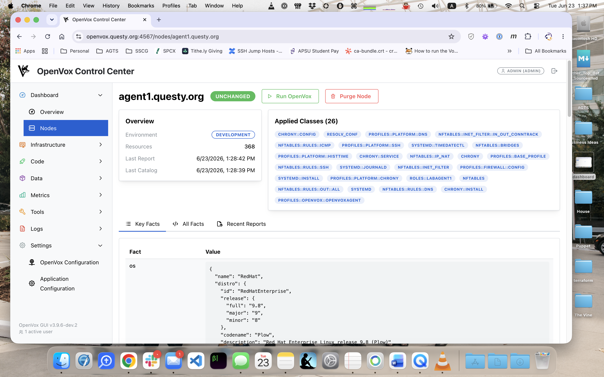
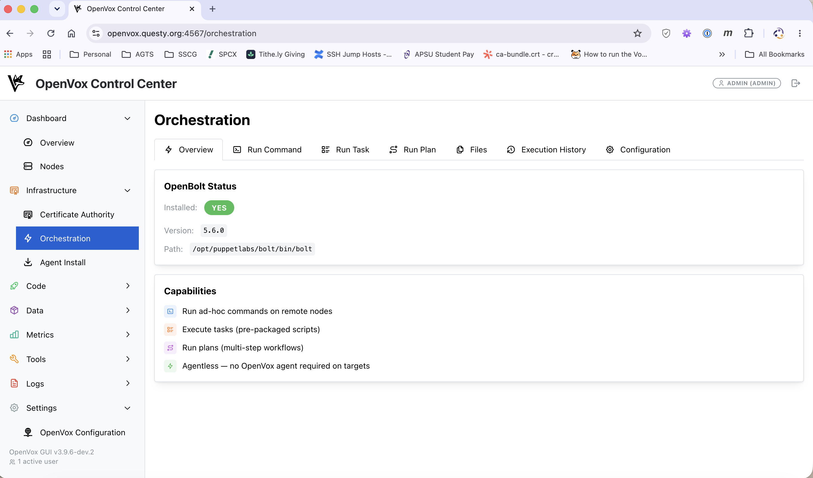

<div align="center">

# 🦊 OpenVox GUI

**A web-based management interface for OpenVox/Puppet infrastructure**

[](https://github.com/cvquesty/openvox-gui/releases)
[](LICENSE)
[](https://python.org)
[](https://react.dev)
[](https://fastapi.tiangolo.com)
[](https://sqlite.org)

[](CHANGELOG.md)
[](https://github.com/cvquesty/openvox-gui/stargazers)
[](https://github.com/cvquesty/openvox-gui/issues)
[](https://github.com/cvquesty/openvox-gui/commits/main)

[Installation](INSTALL.md) · [Update Guide](UPDATE.md) · [Troubleshooting](TROUBLESHOOTING.md) · [Changelog](CHANGELOG.md) · [Contributing](CONTRIBUTING.md)

</div>

---

A user-friendly web interface for managing your OpenVox infrastructure. Think of it as a control center for all your servers — you can see what's happening, fix problems, and make changes from one place.

## 🎯 What is OpenVox GUI?

OpenVox GUI is like a dashboard for your car, but for your servers. If you use OpenVox to manage your servers (and if you don't know what OpenVox is, think of it as software that keeps all your servers configured correctly), then OpenVox GUI gives you a visual way to:

- **See what's happening** - Which servers are healthy, which ones have problems
- **Find and fix issues** - Click through to see exactly what went wrong
- **Make changes** - Update configurations without typing commands
- **Run commands** - Execute tasks on multiple servers at once

## 📸 Screenshots

| Dashboard | Node Details | Orchestration |
|-----------|--------------|---------------|
|  |  |  |

## 🚀 Quick Start

> **Note:** OpenVox GUI must be installed directly on your OpenVox Server. It requires local access to configuration files, SSL certificates, and services on the server to function.

If you just want to get up and running quickly, log in to your OpenVox Server and run:

```bash
# Clone the repository
git clone https://github.com/cvquesty/openvox-gui.git
cd openvox-gui

# Run the installer (it will ask you questions)
sudo ./install.sh

# Open your web browser and go to:
# https://your-server-name:4567
```

That's it! For detailed installation instructions, see the [Installation Guide](INSTALL.md).

## 📚 Documentation

- **[Installation Guide](INSTALL.md)** — Step-by-step guide for new installations
- **[Update Guide](UPDATE.md)** — How to update to newer versions (clone-then-deploy architecture)
- **[LDAP / Active Directory Guide](docs/LDAP.md)** — Configure enterprise authentication
- **[Sudoers Configuration](docs/SUDOERS.md)** — Required sudo rules for the GUI service
- **[Troubleshooting](TROUBLESHOOTING.md)** — Solutions to common problems
- **[Changelog](CHANGELOG.md)** — Complete version history with every change documented
- **[Contributing](CONTRIBUTING.md)** — How to contribute to the project
- **[Contributors](CONTRIBUTORS.md)** — People who helped build this project

## ✨ Main Features

### 📊 Dashboard
See everything at a glance:
- How many servers are running fine vs having problems
- Recent activity and changes
- System health indicators
- Who's currently using the system

### 📋 Detailed Reports
Click on any server to see:
- What changed in the last update
- Any errors or warnings
- Performance metrics (how long things took)
- Complete logs of what happened

### 🚀 Code Deployment
Deploy new configurations to your servers:
- One button to update everything
- Choose specific environments to update
- See the results in real-time
- Keep a history of all deployments

### ⚡ Orchestration (Running Commands)
Run commands on multiple servers at once:
- Execute shell commands across your fleet
- Run pre-built tasks and plans
- **Target ENC groups directly** — select "📁 webservers" instead of individual nodes
- See the output from each server with ANSI color support

### 🏷️ Node Classifier
Control what software and settings each server gets:
- Set defaults for all servers
- Create groups of servers with similar needs
- Override settings for individual servers
- Preview changes before applying them
- **Groups auto-populate Bolt inventory** — no manual inventory.yaml editing

### 🔌 Dynamic Bolt Inventory *(3.x)*
Eliminate manual Bolt inventory maintenance:
- **Classify a node in the GUI → Bolt knows about it immediately**
- `openvox_enc` Bolt plugin queries the ENC database at runtime
- ENC groups become Bolt target groups automatically
- PuppetDB auto-discovery for unclassified nodes
- One-click inventory sync to `/etc/puppetlabs/bolt/inventory.yaml`

### 📁 Data Management
Edit your configuration files directly:
- Browse and edit Hiera data files (server settings)
- Edit configuration files with syntax checking
- Automatic backups before changes
- Create and delete files as needed

### 🔐 Certificate Management
Manage server certificates (like ID cards for servers):
- View all certificates and their status
- Sign new certificates to allow servers to connect
- Revoke certificates for decommissioned servers
- See certificate details and expiration dates

### 📥 Agent Installer *(3.6.0+)*
Bootstrap new OpenVox agents with a single command, the same way Puppet Enterprise does:
- Local mirror of `yum.voxpupuli.org` / `apt.voxpupuli.org` / `downloads.voxpupuli.org`
- Linux: `curl -k https://server:8140/packages/install.bash | sudo bash`
- Windows: PowerShell one-liner with the same shape as PE's installer
- Nightly auto-sync via systemd timer (or sync on demand from the GUI)
- Served on port 8140 (the standard puppetserver port -- existing firewall rules already permit the traffic)
- See [docs/INSTALLER.md](docs/INSTALLER.md) for full details

### 🔍 Explorers
Search and explore your infrastructure:
- **Fact Explorer**: Find servers by their properties (OS, memory, etc.)
- **Resource Explorer**: Search for installed software, services, files
- **PQL Console**: Run advanced queries (for power users)

### 🎨 Themes
Choose how the interface looks:
- **Casual Mode**: Fun, colorful interface with animations
- **Formal Mode**: Clean, professional business interface

## 🛠️ System Requirements

### Minimum Requirements

You need a Linux server with:
- **Operating System**: Red Hat 8+, CentOS 8+, Ubuntu 20.04+, or similar
- **Memory**: At least 2GB RAM (4GB recommended)
- **Disk Space**: 1GB free space
- **Python**: Version 3.10 or newer (3.11+ recommended)
- **Network**: Access to your OpenVox Server and OpenVoxDB

### What Gets Installed

The installer will set up:
- A web server running on port 4567 (configurable)
- A systemd service that starts automatically
- All necessary Python packages in a virtual environment
- A local database for storing settings
- Log files in `/opt/openvox-gui/logs`

## 🚪 Default Access

After installation:
- **URL**: `https://your-server:4567`
- **Username**: `admin`
- **Password**: Check the file `/opt/openvox-gui/config/.credentials`

**Important**: Change the default password immediately after your first login!

## 🔧 Basic Administration

### Starting and Stopping

```bash
# Check if it's running
sudo systemctl status openvox-gui

# Stop the service
sudo systemctl stop openvox-gui

# Start the service
sudo systemctl start openvox-gui

# Restart (after making changes)
sudo systemctl restart openvox-gui
```

### Viewing Logs

```bash
# See recent log entries
sudo journalctl -u openvox-gui -n 50

# Watch logs in real-time (press Ctrl+C to stop)
sudo journalctl -u openvox-gui -f
```

### Managing Users

```bash
# Add a new user
sudo /opt/openvox-gui/venv/bin/python /opt/openvox-gui/scripts/manage_users.py add newuser --role operator

# Change a password
sudo /opt/openvox-gui/venv/bin/python /opt/openvox-gui/scripts/manage_users.py passwd username

# Delete a user
sudo /opt/openvox-gui/venv/bin/python /opt/openvox-gui/scripts/manage_users.py remove username

# List all users
sudo /opt/openvox-gui/venv/bin/python /opt/openvox-gui/scripts/manage_users.py list
```

## What's New in Version 3.6.0

3.6.0 is a major release that introduces the **OpenVox Agent
Installer** feature, consolidates the agent-bring-up workflow into
a single GUI page, and tightens authentication and authorization
across every privileged endpoint. The release rolls up 30 test-build
iterations (3.3.5-1 through 3.3.5-30) into one stable artifact
suitable for production.

### OpenVox Agent Installer (the headline feature)

A full PE-style agent bootstrap workflow for OpenVox:

- **One-line install on Linux** -- the GUI publishes a copy-to-clipboard command of the form
  `curl -k --noproxy <server> https://<server>:8140/packages/install.bash | sudo bash`.
  The script auto-discovers the puppetserver FQDN from the kernel's TCP state and reverse DNS, so no `--server` arg is needed. The `--noproxy` keeps corporate proxies from intercepting the bootstrap curl.
- **One-line install on Windows** -- equivalent PowerShell snippet that downloads `install.ps1` and passes the puppetserver FQDN extracted from the URL via `[System.Uri]$url.Host`.
- **Local OpenVox package mirror** under `/opt/openvox-pkgs/` populated from yum.voxpupuli.org, apt.voxpupuli.org, and downloads.voxpupuli.org. Layout: `yum/`, `apt/`, `windows/`, `mac/` -- one tree per upstream source, mirroring the upstream structure 1:1.
- **PuppetServer mounts `/packages/*` on port 8140** -- the standard puppetserver port that existing firewall rules already permit. Agents reach the mirror without any new firewall holes. The openvox-gui FastAPI app also serves the same content on its own port (4567) as a fallback.
- **Top-level "Infrastructure" nav** with three pages: **Certificate Authority** (CA info + signed-cert management), **Orchestration** (Bolt commands/tasks/plans), **Agent Install** (install commands + mirror status + pending CSR signing).
- **Agent Install page** is one tabbed Card (Linux | Windows | Direct URLs | Mirror Status | Sync Log) plus a Pending Certificate Requests card -- the whole agent bring-up workflow in one place: paste install command -> wait for CSR to appear -> click Sign -> done.
- **Nightly auto-sync** via systemd timer (02:30 + randomised delay). Both `install.sh` (fresh install) and `update_local.sh` (upgrade) offer an interactive "Sync now?" prompt so the mirror is populated before the first agent installs.
- **Self-configuring agent scripts** -- `install.bash` resolves the puppetserver FQDN from a 4-step chain: `--server` arg / env var → `/proc/net/tcp` + reverse DNS of the curl connection (the "just works" path) → server-side rendered placeholder → existing `puppet.conf`. Permanent puppet CA trust installed into `/etc/pki/ca-trust/source/anchors/` (RHEL) or `/usr/local/share/ca-certificates/` (Debian/Ubuntu) so subsequent `apt-get update` / `dnf upgrade` work without flags.

> **First-run sync takes time.** The first sync downloads roughly **1-2 GB** of OpenVox packages from voxpupuli.org and takes **15-45 minutes** on a typical broadband connection. Subsequent syncs are incremental (only changed files). Pick whichever first-sync path fits: the interactive `install.sh` / `update_local.sh` prompt, the **Sync now** button on Infrastructure -> Agent Install, `sudo systemctl start openvox-repo-sync.service` from the CLI, or just wait for the 02:30 nightly timer.

See [docs/INSTALLER.md](docs/INSTALLER.md) for the full feature guide -- architecture, mirror layout, CLI options, security considerations, and troubleshooting.

### UI reorganization

- **Top-level "Infrastructure" nav** with three pages: Certificate Authority, Orchestration, and Agent Install.
- **Agent Install page** holds the entire agent bring-up workflow on a single page: copy-to-clipboard install commands (Linux | Windows | Direct URLs | Mirror Status | Sync Log tabs) plus a Pending Certificate Requests card. Paste the one-liner -> wait for the CSR to appear -> click Sign -> done.
- **Final left-nav order**: Monitoring, Infrastructure, Code, Data, Information, Settings.

### Security hardening

3.6.0 closes every CRITICAL and HIGH finding from an internal security audit. **Every privileged endpoint now requires explicit role authorization** (`require_role("admin")` or `require_role("admin", "operator")`) on top of JWT validation -- previously an authenticated viewer could trigger Bolt commands as root, sign or revoke certs, edit Hiera data, or restart the puppet stack:

- **Bolt** `/run/{command,task,plan}` and `/file/{upload,download}` -- admin or operator
- **Certificate Authority** sign / revoke / clean -- admin or operator
- **Configuration** (puppet.conf, Hiera, SSL, .env, restart-puppet-stack, puppet lookup) -- admin only
- **External Node Classifier** mutating endpoints -- admin or operator
- **PQL Console** raw queries -- admin or operator (PuppetDB facts can leak Hiera-rendered passwords)
- **Deploy webhook** (`/api/deploy/webhook`) -- now requires HMAC-SHA256 signature verification with a shared secret. Disabled by default; opt in via `OPENVOX_GUI_DEPLOY_WEBHOOK_SECRET` in `.env`. The `ref` field is strictly validated against a regex before being passed as a subprocess argument
- **JWT logout** now actually invalidates the token via a server-side denylist. Pre-3.6.0, `/api/auth/logout` only deleted the cookie -- the underlying JWT stayed cryptographically valid for its full 24-hour expiry. New tokens carry a `jti` claim used as the denylist key
- **LDAP bind password** is now encrypted at rest in SQLite using Fernet with a key derived from `OPENVOX_GUI_SECRET_KEY`. Existing plaintext values are read transparently and re-encrypted on the next save through the LDAP config form
- **Sudoers wildcards tightened**: `openssl x509 *` (which allowed `-out /etc/shadow`) replaced with explicit per-form rules; `puppetserver ca *` replaced with per-subcommand rules; `r10k-deploy.sh` argv whitelisted inside the wrapper script

### Quality + reliability

- **Cleared 3 npm-audit high-severity findings** (vite 6.4.1->6.4.2, lodash 4.18.1, picomatch 4.0.4)
- **Async cert handlers**: `subprocess.run` calls in async cert routes wrapped in `asyncio.to_thread` so the event loop doesn't block while shelling out
- **Sync script lock-file race** closed; trap installed before lock write
- **Bare `except:` clauses narrowed** so `KeyboardInterrupt` / `CancelledError` propagate

### Documentation

- **`docs/INSTALLER.md`** is now the canonical reference for the agent installer feature: architecture, mirror layout, CLI options, security model, and a troubleshooting section covering the actual failures the test campaign hit (407 proxy, untrusted cert, mirror-not-synced 404)
- **`docs/SUDOERS.md`** updated with the tightened sudoers payload + the new sync-trigger rule
- **`INSTALL.md`** documents the new install-time prompts for the agent installer (`CONFIGURE_PKG_REPO`, `RUN_INITIAL_SYNC`)
- **`UPDATE.md`** "Special note for upgrades to 3.6.0" walks operators through what the upgrade does and the one mandatory action (set the webhook secret if you use the deploy webhook)
- **`TROUBLESHOOTING.md`** has a dedicated Agent Installer section with the most common gotchas

### Per-iteration changelog

For the full development history of how 3.6.0 came together (31 test-build iterations leading up to this release), see [CHANGELOG.md](CHANGELOG.md).

## What's New in Version 3.3.0

### ⚡ Orchestration — Live PuppetDB Targets
- **"All nodes" now resolved from PuppetDB** — selecting "All nodes" in the Orchestration UI queries PuppetDB for every known certname in real-time instead of relying on the static `inventory.yaml` file.

### 🔧 Deploy Reliability
- **SSL-aware health checks** — `update_local.sh` and `deploy.sh` now detect when SSL is enabled and use HTTPS for the post-restart health check. Fixes the false "Service did not become healthy" error.

### 📊 Dashboard Enhancements
- **Status trends chart layered** — green (unchanged) renders as a background field with orange, red, and blue superimposed in the foreground.
- **Pie chart with 2D/3D toggle** — node status overview now uses a pie chart with a toggle between flat and 3D views.

### 🔐 Native SSL Support
- **HTTPS on port 4567** — the GUI can now serve HTTPS directly via uvicorn using Puppet certs. Enable during install or via `update_local.sh`.
- **SSL Configuration tab** — view and manage SSL settings under Settings > Application Configuration.

For a complete list of changes, see the [Changelog](CHANGELOG.md).

## 📞 Getting Help

### If Something Goes Wrong

1. **Check the Troubleshooting Guide**: [TROUBLESHOOTING.md](TROUBLESHOOTING.md) has solutions to common problems
2. **Look at the Logs**: Run `sudo journalctl -u openvox-gui -n 100` to see recent errors
3. **Check Your Network**: Make sure you can reach OpenVox Server and OpenVoxDB from this server
4. **File an Issue**: Visit [GitHub Issues](https://github.com/cvquesty/openvox-gui/issues) to report bugs

### Community

- **GitHub**: [https://github.com/cvquesty/openvox-gui](https://github.com/cvquesty/openvox-gui)
- **Discussions**: Use GitHub Discussions for questions and ideas
- **Contributing**: Pull requests welcome! See [CONTRIBUTING.md](CONTRIBUTING.md)

## 📄 License

This project is licensed under the Apache 2.0 License. This means you can:
- Use it for free (even commercially)
- Modify it to suit your needs  
- Distribute it to others
- Just keep the license notice intact

See the [LICENSE](LICENSE) file for the legal details.

## 🙏 Acknowledgments

Built with love for the OpenVox community. Special thanks to:
- The Vox Pupuli community for maintaining OpenVox modules
- All contributors who have submitted bugs, suggestions, and code
- You, for using OpenVox GUI!

---

<div align="center">

**Ready to get started?** Head over to the [Installation Guide](INSTALL.md) for step-by-step instructions!

<sub>This document was created with the assistance of AI (Grok, xAI). All technical content has been reviewed and verified by human contributors.</sub>

</div>
