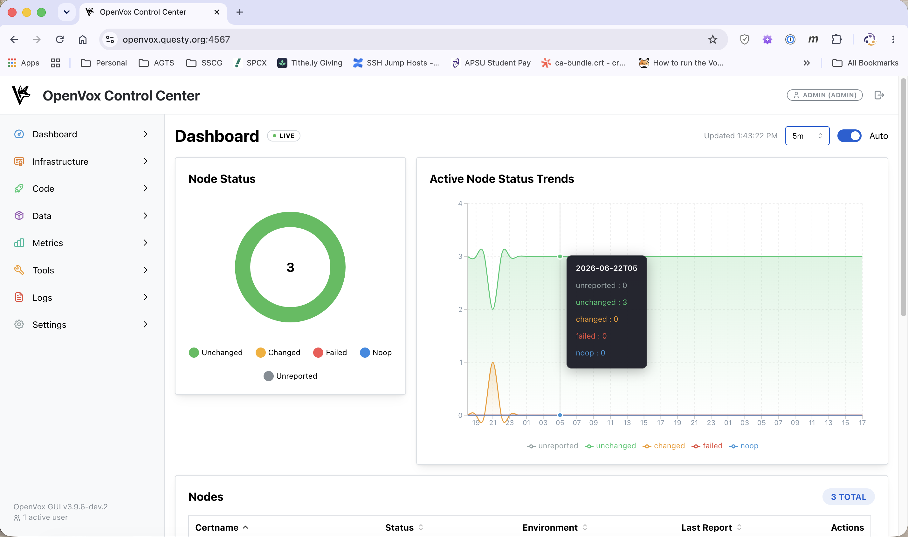
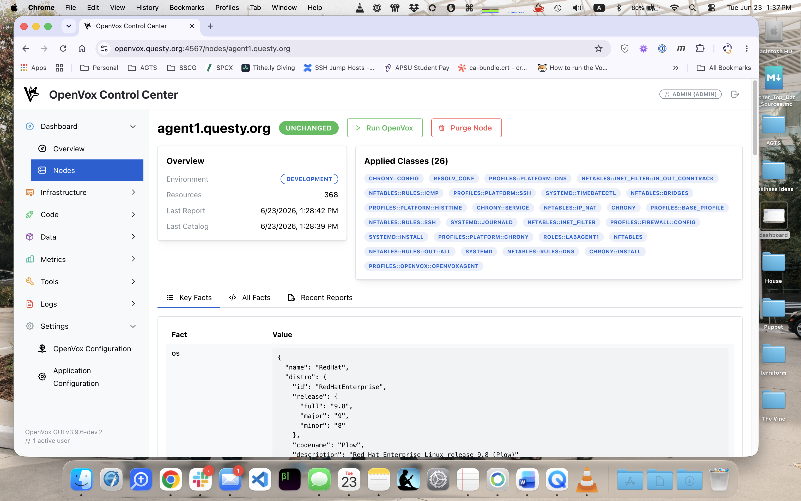
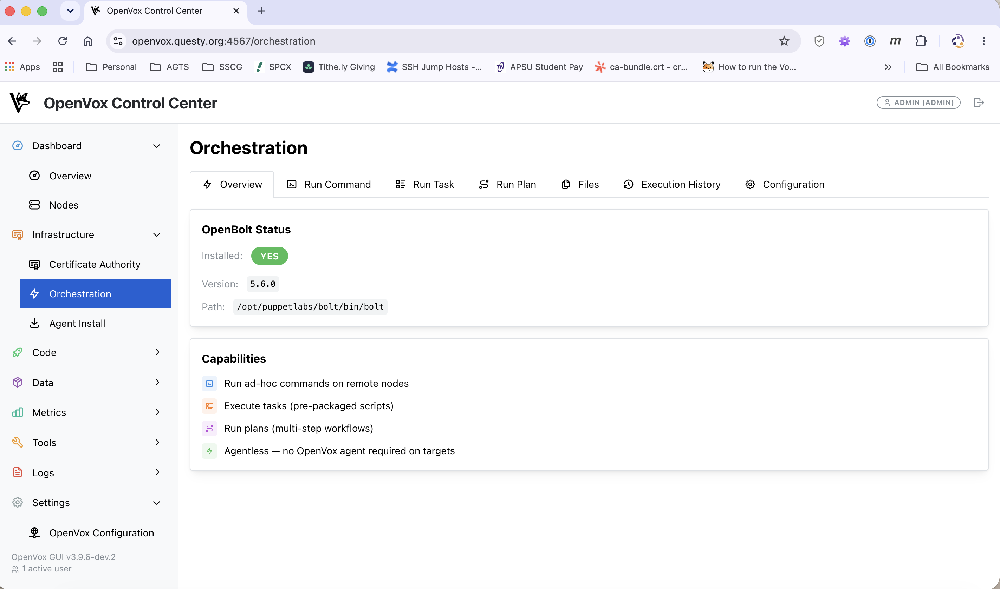
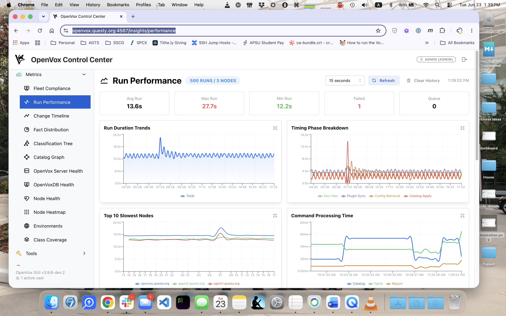
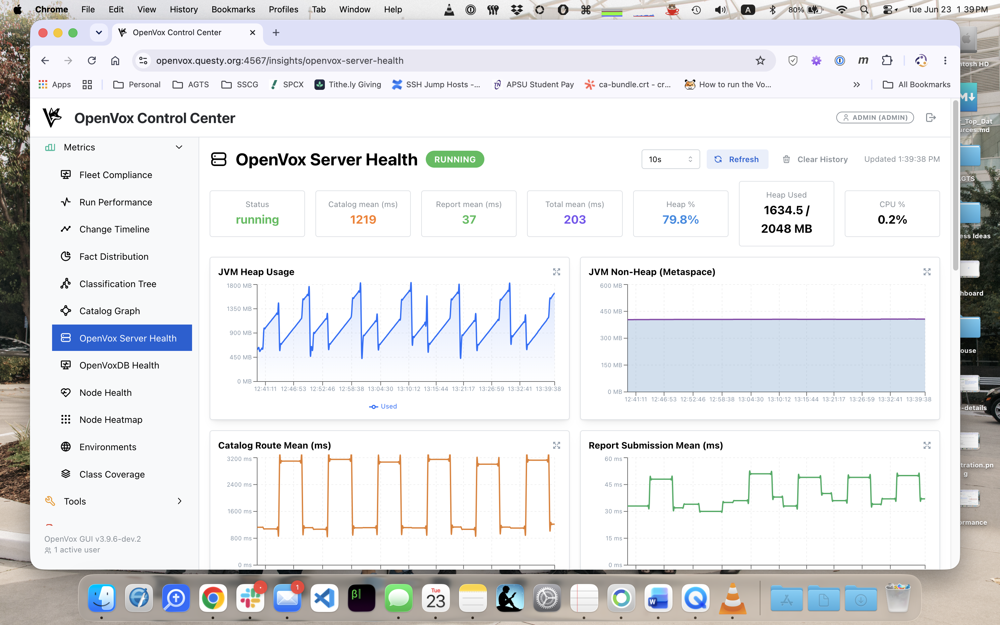
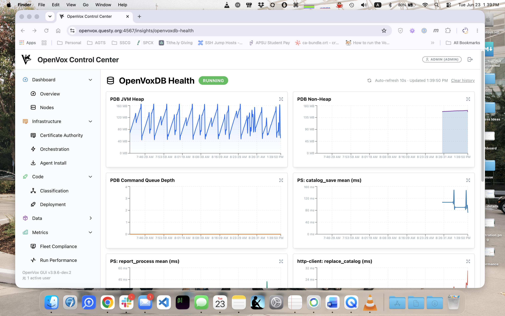

<div align="center">

# 🦊 OpenVox GUI

**A web-based management interface for OpenVox/Puppet infrastructure**

[](https://github.com/cvquesty/openvox-gui/releases)
[](LICENSE)
[](https://python.org)
[](https://react.dev)
[](https://fastapi.tiangolo.com)
[](INSTALL.md)
[](docs/CLUSTERED_SHARED_DB.txt)

[](https://github.com/cvquesty/openvox-gui/actions/workflows/ci.yml)
[](CHANGELOG.md)
[](https://github.com/cvquesty/openvox-gui/actions/workflows/security.yml)
[](docs/STATUS.md)
[](https://github.com/cvquesty/openvox-gui/stargazers)
[](https://github.com/cvquesty/openvox-gui/issues)
[](https://github.com/cvquesty/openvox-gui/commits/main)

[Installation](INSTALL.md) · [**Status**](docs/STATUS.md) · [Features](docs/FEATURES.md) · [Architecture](docs/ARCHITECTURE.md) · [VIP sessions](docs/VIP_SESSIONS.md) · [ovox CLI](ovox/README.md) · [Troubleshooting](TROUBLESHOOTING.md) · [Changelog](CHANGELOG.md)

</div>

---

A user-friendly web interface for managing your OpenVox infrastructure. Think of it as a control center for all your servers — you can see what's happening, fix problems, and make changes from one place.

## 🎯 What is OpenVox GUI?

OpenVox GUI is like a dashboard for your car, but for your servers. If you use OpenVox to manage your servers (and if you don't know what OpenVox is, think of it as software that keeps all your servers configured correctly), then OpenVox GUI gives you a visual way to:

- **See what's happening** - Which servers are healthy, which ones have problems
- **Find and fix issues** - Click through to see exactly what went wrong
- **Make changes** - Update configurations without typing commands
- **Run commands** - Execute tasks on multiple servers at once

**Plus a first-class CLI** (`ovox`):

`ovox` is a full-featured, noun-verb style command-line client (think `gh`, `kubectl`, or `git`). It is a **core subsystem** of OpenVox GUI — not an afterthought:

- `ovox nodes list --failed`, `ovox certs sign web01`, `ovox pql '...'`, `ovox infra health`, `ovox token generate`
- Ships automatically with the GUI and symlinked at `/usr/local/bin/ovox` (exact Puppet/OpenVox convention)
- Thin client: talks to the same FastAPI backend as the web UI
- Ideal for operators, scripts, CI/CD, and anyone who lives in the terminal
- Full support for long-lived service tokens, dynamic Bolt inventory via `openvox_enc`, and infrastructure tuning

See the dedicated **[ovox documentation](ovox/README.md)** for the complete command reference.

## 📸 Screenshots

| Dashboard           | Node Details         | Orchestration          |
|---------------------|----------------------|------------------------|
|  |  |  |
| Performance Metrics | Server Health        | DB Health              |
|---------------------|----------------------|------------------------|
|  |  |  |

## 🚀 Quick Start

> **Most common path = all-in-one:** install OpenVox GUI **on your OpenVox Server** (same host as puppetserver / agent). That is what Quick Start and `install.sh` optimize for.  
> **Clustered / multi-DC** (dedicated console, separate compilers/CA/PDB) is fully supported in the 3.14 train — see [docs/STATUS.md](docs/STATUS.md) and the Advanced section of [INSTALL.md](INSTALL.md).

If you just want to get up and running quickly, log in to your OpenVox Server and run:

```bash
# Clone the repository
git clone https://github.com/cvquesty/openvox-gui.git
cd openvox-gui

# Run the installer (it will ask you questions)
sudo ./install.sh

# Open your web browser and go to:
# https://your-server-name:4567
```

That's it! For detailed installation instructions, see the [Installation Guide](INSTALL.md).

## 📚 Documentation

| Doc | Contents |
|-----|----------|
| **[docs/STATUS.md](docs/STATUS.md)** | **Where we are** — AIO vs clustered readiness, 3.12.1-dev train |
| **[docs/FEATURES.md](docs/FEATURES.md)** | Canonical page-by-page feature inventory |
| [INSTALL.md](INSTALL.md) | **AIO first**; clustered in advanced section |
| [UPDATE.md](UPDATE.md) | Clone-then-deploy updates, maintenance windows |
| [docs/ARCHITECTURE.md](docs/ARCHITECTURE.md) | System design, single vs clustered console |
| [docs/VIP_SESSIONS.md](docs/VIP_SESSIONS.md) | Dual-console VIP session / poll behaviour (3.12+) |
| [docs/CLUSTERED_SHARED_DB.txt](docs/CLUSTERED_SHARED_DB.txt) | Clustered DB + Spock runbook (two databases, two meshes) |
| [docs/LDAP.md](docs/LDAP.md) | LDAP / Active Directory |
| [docs/SUDOERS.md](docs/SUDOERS.md) | Service-user sudo rules |
| [docs/METRICS.md](docs/METRICS.md) | Jolokia / auth.conf for Insights JMX charts |
| [docs/HOST_HEALTH.md](docs/HOST_HEALTH.md) | Serving-estate OS metrics |
| [docs/INSTALLER.md](docs/INSTALLER.md) | Agent package mirror + bootstrap on 8140 |
| [docs/PERFORMANCE.md](docs/PERFORMANCE.md) | GUI workers, caches, SWR |
| [docs/TUNING.md](docs/TUNING.md) | `ovox infra` JVM / server tuning |
| [ovox/README.md](ovox/README.md) | CLI reference |
| [TROUBLESHOOTING.md](TROUBLESHOOTING.md) | Common failures |
| [CHANGELOG.md](CHANGELOG.md) | Full version history |
| [SECURITY.md](SECURITY.md) | Vulnerability reporting |
| [docs/TESTING.md](docs/TESTING.md) | Local and GitHub Actions test suite |
| [docs/releases/](docs/releases/) | Stable release press kits |

## ✨ Main Features

> Full detail: **[docs/FEATURES.md](docs/FEATURES.md)**. Nav groups: **Overview** → **Infrastructure** → **Classification & Code** → **Data** → **Explore** → **Insights** → **Settings**.

### Overview — Dashboard, Nodes, Reports
- **Live fleet** = active OpenVoxDB `/nodes` (catalogs). DNS RR names hidden; `ovcompilers.*` HAProxy VMs stay visible.
- Dashboard trends, sessions, optional auto-refresh (SWR — no blank flash)
- Nodes OpsTable / filters / export; node detail **Run OpenVox**, purge, classify
- Reports list + detail (hash prefix / peer-aware); exit code **2** = successful apply with changes

### Infrastructure — CA, Orchestration, Agent Install, Cert Audit
- CA: sign/revoke/clean, trusted facts; **remote CA HTTP API** on dedicated consoles (`OPENVOX_GUI_PUPPET_CA_HOST` = CA VIP)
- Bolt command/task/plan; ENC groups as targets; **one run per click** for result tabs
- Agent package mirror + one-liners on **8140** ([INSTALLER.md](docs/INSTALLER.md))
- Certificate Audit for CA vs PDB orphans

### Classification & Code — ENC + r10k
- ENC deep merge Common → Environment → Group → Node; HTTP classify for agents
- Compilers use `enc.py` + `OPENVOX_GUI_API_BASE` (console VIP)
- r10k deploy; clustered **stage/activate** to compilers; HMAC deploy webhook

### Data & Explore
- Hiera files + lookup explain; OpenVox conf editor under Settings
- PQL console, Fact / Resource explorers, Package Inventory + export actions

### Insights — Monitoring, catalog, Inventory, Logs
- NOC **Monitoring** wallboard + 13-page metrics catalog (compliance, performance, Server/DB health, **Host Health**, …)
- Only **Host Health** time series persist on server disk (`data/host_metrics/`); other series are RAM/browser/OpenVoxDB — see FEATURES.md
- Log Viewer: journal/file; clustered **CA vs compiler** tabs

### Settings, auth, multi-console
- Application config: users, LDAP, **cluster topology**, console **VIP hosts**, shared DB URL / SECRET_KEY, encrypted secrets
- SSL wizard (org / Let’s Encrypt / Puppet certs)
- Roles: **admin / operator / certops / viewer**; httpOnly JWT + denylist; dual-console VIP session safety ([VIP_SESSIONS.md](docs/VIP_SESSIONS.md))
- Themes: Casual / Formal; command palette ⌘/Ctrl+K

### ovox CLI
Same API as the UI — nodes, certs, pql, infra, token, maintenance. See [ovox/README.md](ovox/README.md).

## 🖥️ ovox CLI — First-Class Command Line Experience

`ovox` is not a sidecar — it is a **core, first-class subsystem** of OpenVox GUI with equal standing to the web interface.

It is a thin, fast, noun-verb CLI that reuses the exact same backend API as the web UI:

```bash
ovox login
ovox status
ovox nodes list --failed
ovox certs sign web01.example.com
ovox pql 'nodes[certname] { facts.os.family = "RedHat" }'
ovox infra health
ovox infra recommend
ovox infra tune --server --dry-run
ovox token generate --user bolt --name "Bolt service account" --expires 0
```

**Key characteristics:**

- **Unified versioning** with the main GUI (root `VERSION` + `scripts/bump-version.sh` keeps ovox files in sync) as of 3.7.3
- Installed automatically with the GUI and available at `/usr/local/bin/ovox`
- Works locally on the server **or remotely** against any OpenVox GUI instance
- Excellent for operators who prefer the terminal, scripting, and CI
- Powers advanced workflows: long-lived service tokens for the dedicated `bolt` user, authenticated dynamic Bolt inventory (`openvox_enc` plugin), and safe infrastructure tuning

Full documentation, command reference, and examples live in the **[ovox subdirectory](ovox/README.md)**.

## 🛠️ System Requirements

### Minimum Requirements

You need a Linux server with:
- **Operating System**: Red Hat 8+, CentOS 8+, Ubuntu 20.04+, or similar
- **Memory**: At least 2GB RAM (4GB recommended)
- **Disk Space**: 1GB free space
- **Python**: Version 3.10 or newer (3.11+ recommended)
- **Network**: Access to your OpenVox Server and OpenVoxDB

### What Gets Installed

The installer will set up:
- A web server running on port 4567 (configurable)
- A systemd service that starts automatically
- All necessary Python packages in a virtual environment
- A local database for storing settings
- Log files in `/opt/openvox-gui/logs`
- **The `ovox` CLI** (installed into the venv and symlinked at `/usr/local/bin/ovox`) — a first-class subsystem with unified versioning (since 3.7.3) and full feature parity for scripting and operators

## 🚪 Default Access

After installation:
- **URL**: `https://your-server:4567`
- **Username**: `admin`
- **Password**: Check the file `/opt/openvox-gui/config/.credentials`

**Important**: Change the default password immediately after your first login!

## 🔧 Basic Administration

### Starting and Stopping

```bash
# Check if it's running
sudo systemctl status openvox-gui

# Stop the service
sudo systemctl stop openvox-gui

# Start the service
sudo systemctl start openvox-gui

# Restart (after making changes)
sudo systemctl restart openvox-gui
```

### Viewing Logs

```bash
# See recent log entries
sudo journalctl -u openvox-gui -n 50

# Watch logs in real-time (press Ctrl+C to stop)
sudo journalctl -u openvox-gui -f
```

### Managing Users

```bash
# Add a new user
sudo /opt/openvox-gui/venv/bin/python /opt/openvox-gui/scripts/manage_users.py add newuser --role operator

# Change a password
sudo /opt/openvox-gui/venv/bin/python /opt/openvox-gui/scripts/manage_users.py passwd username

# Delete a user
sudo /opt/openvox-gui/venv/bin/python /opt/openvox-gui/scripts/manage_users.py remove username

# List all users
sudo /opt/openvox-gui/venv/bin/python /opt/openvox-gui/scripts/manage_users.py list
```

## Current train (3.14) and versioning

**Current stable:** **3.14.0** (`v3.14.0`).  
Full map: [docs/STATUS.md](docs/STATUS.md) · features: [docs/FEATURES.md](docs/FEATURES.md) · history: [CHANGELOG.md](CHANGELOG.md).

### 3.14.0 headlines (AIO + clustered)
- **AIO still first** — install on the OpenVox Server; SQLite; local services
- **Clustered ops** — Code Deploy / Hiera / Agent Install without compiler sudo TTY; `OPENVOX_GUI_PUPPET_CA_HOST` is the CA VIP
- **Lean PDB + last-good fleet** — one PuppetDB VIP, lean report extract, VIP probe cannot wipe a known fleet
- **Monitoring paints** — measured chart width, duration axes, Fleet Population dual axis
- **Package mirror** — EL9/EL10 + OpenVox 8/9 only; unselected apt/yum trees are pruned (will not fill a 70G disk)
- **Run OpenVox** — agent exit 2 is success; Human tab shows Puppet CLI

### Earlier 3.x (still in the product)
- **3.12.0** clustered consoles / one fleet status · **3.10.6** performance / SWR · **3.7** Insights / maintenance · **3.6** agent installer, SSL wizard, RBAC

### How we version
- **Stable:** `MAJOR.MINOR.PATCH` (e.g. **3.14.0**)
- **Pre-release:** `3.14.1-dev.N` / `3.15.0-rc.N` (PEP 440 only — not `gamma`) · ovox lockstep with GUI
- **Branch:** `main` only · GitHub Releases only for intentional stables

> **Metrics:** [docs/METRICS.md](docs/METRICS.md) · Host Health: [docs/HOST_HEALTH.md](docs/HOST_HEALTH.md)

## 📞 Getting Help

### If Something Goes Wrong

1. **Check the Troubleshooting Guide**: [TROUBLESHOOTING.md](TROUBLESHOOTING.md) has solutions to common problems
2. **Look at the Logs**: Run `sudo journalctl -u openvox-gui -n 100` to see recent errors
3. **Check Your Network**: Make sure you can reach OpenVox Server and OpenVoxDB from this server
4. **File an Issue**: Visit [GitHub Issues](https://github.com/cvquesty/openvox-gui/issues) to report bugs

### Community

- **GitHub**: [https://github.com/cvquesty/openvox-gui](https://github.com/cvquesty/openvox-gui)
- **Discussions**: Use GitHub Discussions for questions and ideas
- **Contributing**: Pull requests welcome! See [CONTRIBUTING.md](CONTRIBUTING.md)

## 📄 License

This project is licensed under the Apache 2.0 License. This means you can:
- Use it for free (even commercially)
- Modify it to suit your needs  
- Distribute it to others
- Just keep the license notice intact

See the [LICENSE](LICENSE) file for the legal details.

## 🙏 Acknowledgments

Built with love for the OpenVox community. Special thanks to:
- The Vox Pupuli community for maintaining OpenVox modules
- All contributors who have submitted bugs, suggestions, and code
- You, for using OpenVox GUI!

---

<div align="center">

**Ready to get started?** Head over to the [Installation Guide](INSTALL.md) for step-by-step instructions!

<sub>This document was created with the assistance of AI (Grok, xAI). All technical content has been reviewed and verified by human contributors.</sub>

</div>
